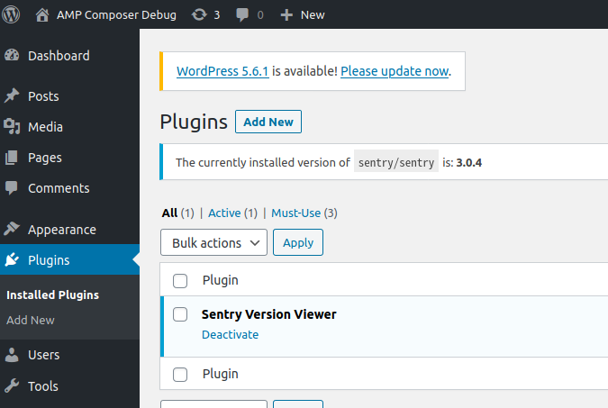

# Summary

This repo serves as an environment to debug issue [ampproject/amp-wp#5609](https://github.com/ampproject/amp-wp/issues/5609).

Composer [v2.0.9](https://github.com/composer/composer/releases/tag/2.0.9) includes a bug fix that should resolve the
above issue, as all installed packages (whether global or local) should now be reported when several vendor directories
are present in the same runtime (which is the case here, as the AMP plugin comes bundled with its own Composer autoloader).
The theory is that since all installed packages should now be reported, the error reported in
[ampproject/amp-wp#5609](https://github.com/ampproject/amp-wp/issues/5609) should now be resolved and Composer v2 can
be reused for v2.0 of the AMP plugin.

The bundled plugin [`sentry_version_viewer`](web/app/plugins/sentry_version_viewer.php) is provided to replicate a
similar error stacktrace that was reported in the issue when the AMP plugin v2.0.6 was active.

A [modified version](amp.zip) of the AMP plugin v2.0.6 is also provided that has its Composer dependencies installed
with Composer v2.0.9. This version of the plugin should not cause any errors to be produced.

To replicate the Composer oriented WordPress stack the reporter had, the [Bedrock](https://github.com/roots/bedrock)
project is used.

# Setup

> :warning: Ensure you have Composer v2.0.9 or greater installed :warning:

[Lando](https://lando.dev/) is required to be installed before continuing.

From the command line run the following:

- `composer install`
- `lando start`
- `lando setup-wp`

# Instructions

Once setup, you should be able to access the site at https://amp-composer-debug.lndo.site. The default
admin username is `admin` and password `password`.

On the "Installed Plugins" page the "Sentry Version Viewer" plugin should be activated and displaying the currently
installed version of the `sentry/sentry` Composer package:



To install the AMP v2.0.6 plugin from WordPress.org, run:

```bash
lando install-amp original
```

Then back on the "Installed Plugins" page, activate the AMP plugin, and the following error should be shown (or view
the debug log at `web/app/debug.log`):


Now to install the modified version of the plugin built with Composer v2.0.9, run:

```bash
lando install-amp modified
```

Once that's completed, revisit the "Installed Plugins" page and activate the plugin. No errors should be reported, and
the notice showing the installed version of `sentry/sentry` should still be present:


